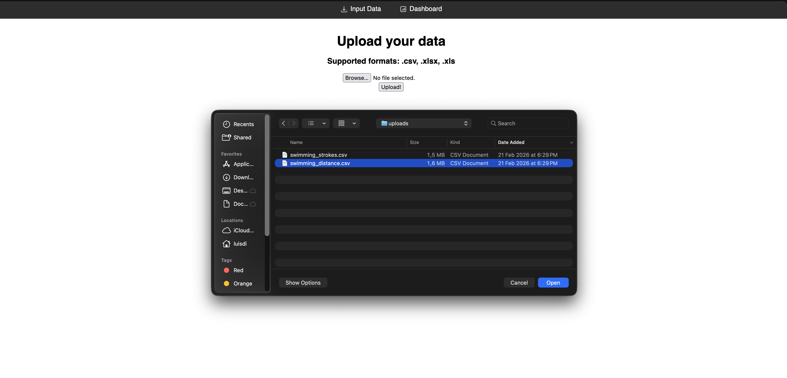
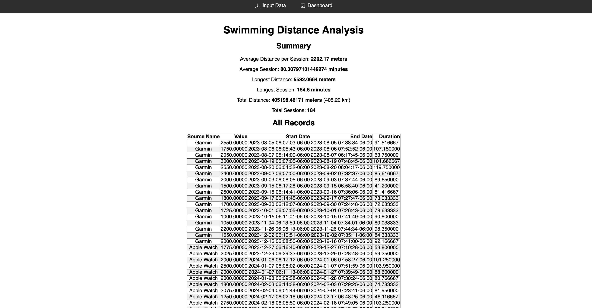

# swimming_app
This product is geared towards swimmers with iPhones that want to analyze their training history, they will manually download their health data and upload it into the app which will then store and analyze their swimming workouts and provide a nice summary with statistics overtime.

## Run the app

```
docker-compose up --build
```

## Demo the app

Once the app is running you can upload the file "uploads/swimming_distance.csv". Then check the Dashboard tab to examine the data.

### Step 1:

Open the browser and go to: http://127.0.0.1:8000/ (localhost:8000)


### Step 2:

Click on the dashboard tab to visualize the data you just uploaded.



## Monitoring

You can find Prometheus and Grafana at:

Prometheus
http://localhost:9090/query

Grafana
http://localhost:3000/login

## DB queries

```
sqlite3 ./instance/swimmers.db "SELECT count(*) FROM swimming_workout LIMIT 5;"
```

Clear out table:
```
sqlite3 ./instance/swimmers.db "drop table swimming_workout;"
```
